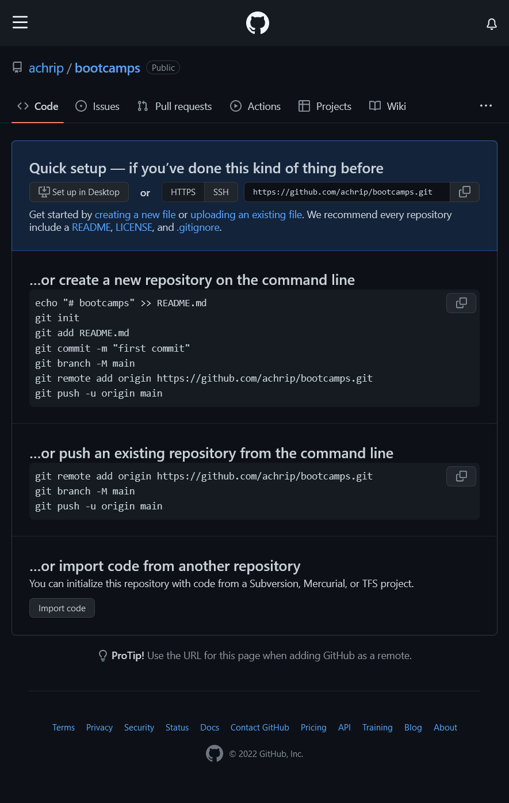
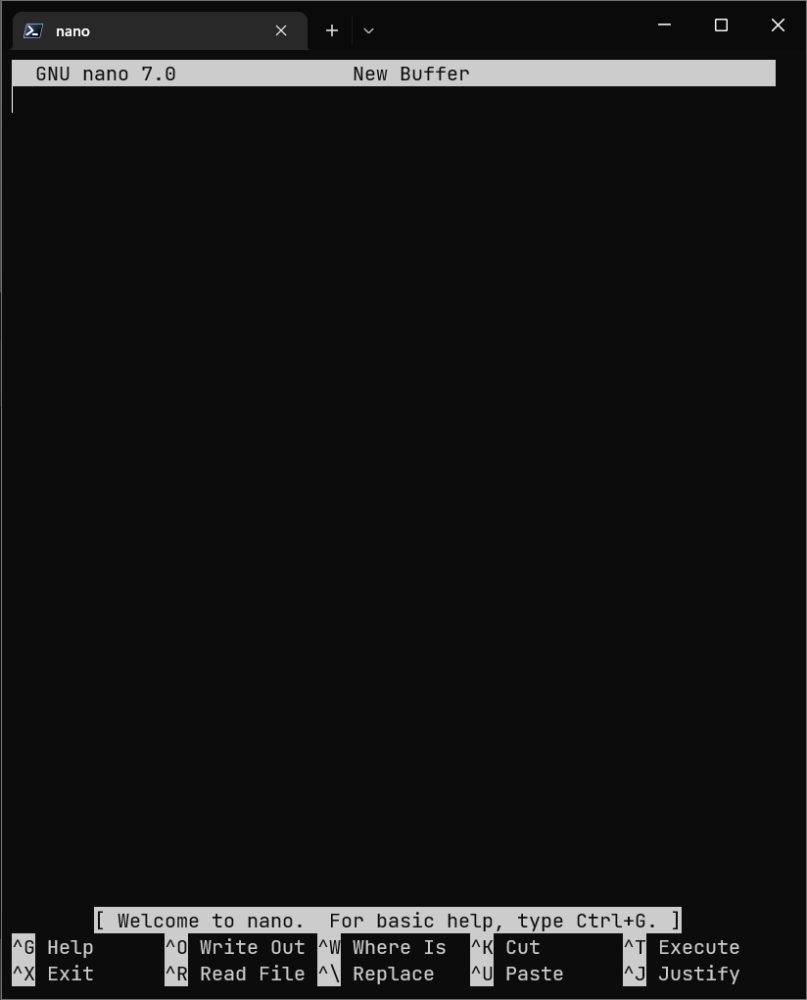

## Assignment Documentation
Prerequisites :
1. GitHub Account
2. Git on the operating system of your choice

#### Creating the repository on GitHub 
> If you are unfamiliar yet as to creating a repository on GitHub, the [GitHub Docs](https://docs.github.com/en/get-started/quickstart/create-a-repo) has provided a simple guide. 

First, we will create a GitHub repository on our GitHub account—in my case, I'd name it `Bootcamps` since I want to store all the bootcamp projects here. But you can name it as you see fit—without adding a `.gitignore` and `README.md` file. 

Once we're done, GitHub will create a repository and the contents should be as follows:



For now, let's keep the GitHub repo as-is and try populating it with a file that we will create on our local machine. 

#### Creating a directory and adding a readme.md

For those who are new, below are the steps to creating a directory in the terminal:

1. Open the terminal 

2. ```
   $ mkdir Bootcamps
   $ mkdir Bootcamps/hotel-del-jojo
   $ cd hotel-del-jojo
   ```

Now that we've created and opened a the `hotel-del-jojo` directory inside the `Bootcamp` directory, its time to create a **`readme.md`** with the terminal too. Here are the steps:

1. `touch readme.md`

2. `nano readme.md` (Here you can use other text editor such as emacs or vi. I'm using nano for the sake of convenience).

   This would be how your terminal would look right now: 

   

3. Paste this md text to the `readme.md`

   ```markdown
   # Hotel del Jojo
   Selamat datang di _Hotel del Jojo!_
   
   Berikut adalah harga dari kamar-kamar yang kami punya: 
   | | Tipe Kamar | Harga |
   |---|---|---|
   |1| Pantai | ₩3,000,000 |
   |2| Rooftop | ₩4,500,000 |
   |3| Taman | ₩5,000,000 | 
   |4| Bar | ₩1,250,000 |
   
   **Selamat menginap!**
   ```
   
4. Save the file by pressing `Ctrl + X` and when prompted yes or no press `Y` (case insensitive)

#### Pushing a local directory into an empty GitHub repository

We now have a directory for our current project and—if you still remember—an empty GitHub repo from earlier. In this part we will attempt to push the directory on our local machine into the repo using CLI ,

1. If you're not in your project directory(bootcamps, in my case), navigate into the project directory first.

2. Initialize the directory as a Git repository by typing `git init`. This will create a hidden `.git` file that stores all of the objects and refs that Git uses and creates as a part of our project's history. 

   ```
   $ git init
   ```

3. By default, Git creates a branch with the name master, but let's change the name to `main` to make things easier. To do so, type `git branch -m main` to change the active branch name

   ``` 
   $ git branch -m main
   ```

4. If we want to use Git with GitHub, we must create a remote repository for the local directory. A remote repository is the repo that is located on GitHub. Copy the HTTPS URL of the GitHub repository (usually is formatted like `https://github.com/<GitHub_Username>/<repository_name>.git`) and then go back to the terminal and type `git remote add origin <repo URL>`

   ```
   $ git remote add origin https://github.com/achrip/bootcamps
   ```

5. Once the local repo has established a remote to the GitHub repo, its time to update the GitHub repo with files from our local repo. Move all our files from the working tree into the staging area by typing `git add .`

   ```
   $ git add .
   ```

6. After all our files are moved into the staging area, type `git commit -m` followed by a commit message between a quotation mark (`"message"`). Let's make the message "initial commit".

   ```
   $ git commit -m "initial commit"
   ```

7. Now all we need to do is to push our commit to GitHub with the command

   ``` 
   $ git push -u origin main
   ```

8. At this point, Git will prompt your username and password. Fill the username with your git username and the password with your **Personal Access Token** (more on that [here](https://docs.github.com/en/authentication/keeping-your-account-and-data-secure/creating-a-personal-access-token))

   ```
   $ git push -u origin main
   ```

Congratulations! Now the newly pushed file will be available in your GitHub.

#### Adding more directories

Now to add more directories like the problem mentioned, we just need to repeat the steps that we took before when creating the bootcamp and hotel directory

```
# return to the main directory, which is bootcamps
$ cd ~/Bootcamps

# create two directories(assistant and manager) inside hotel-del-jojo directory
$ mkdir Bootcamps/hotel-del-jojo/asisten
$ mkdir Bootcamps/hotel-del-jojo/manager

# create .txt files for each directories
$ touch Bootcamps/hotel-del-jojo/asisten.txt
$ touch Bootcamps/hotel-del-jojo/manager/data-manager.txt

```

#### Moving and Renaming Directories/Files

##### Moving Directories/Files

If by accident you have made a file outside of the local repo or you already have one and then you want to include that file to the repo, then you can just move the file into the local repo and then push the changes to GitHub. Here's how to do it via terminal

```
# let's say i want to create a 'bos' directory outside of the hotel
$ cd ~/Bootcamps
$ mkdir bos

# let's move the 'bos' directory into the 'hotel-del-jojo' directory
$ mv bos hotel-del-jojo
```

To satisfy the problem's prerequisites, we will create a text file containing a string named `bos.txt` inside the bos folder. Let's have the string inside the file say "Jojo Man Wol".

```
$ cd ~/Bootcamps/hotel-del-jojo/bos
$ touch bos.txt
$ nano bos.txt
```

##### Renaming Directories/Files

The method to move directories/files can also be used to rename directories/files. This is because the way that the `mv` command works, that is `mv <source> <destination>`.  Let's try renaming the data-manager.txt 

```
# since we were in the 'bos' directory, let's just get out one directory to the 'hotel-del-jojo' directory
$ cd .. 

#rename the 'data-manager.txt' to 'manager.txt'
$ mv manager/data-manager.txt manager/manager.txt
```


After adding a new file and directory, its time to commit the modifications we've made to Git. To do so, 

```
# return to the 'Bootcamps' directory 
$ cd ~/Bootcamps
$ git add .
$ git commit -m "added bos directory and text file"
```

Don't forget to push the local repo to remote. Since we've previously created a PAT, we will use that again if prompted user credentials.

````
# the command below will automatically push to origin from the main branch or any branch we are on
$ git push 
````

#### Removing files

When the need arises for you to remove a file or directory from a git repo, we can use the `rm` command on the terminal to achieve that. Let's say we want to delete the manager directory from the repo, then, 

```
#make sure we are located within the 'hotel-del-jojo' directory
$ cd ~/Bootcamps/hotel-del-jojo

# remove files or directories recursively
$ rm -rf manager
```

After we've removed the directories and/or files, don't forget to push the changed to GitHub.

#### Reverting Commits

If, by any chance, you regretted your choice in the previous commit—which is deleting the manager directory and its contents—then we could just revoke the commit. Git has implemented this kind of feature with the command `revert`. Here's how to execute the command:

```
$ cd ~/Bootcamp/hotel-del-jojo

# this is the tree right now
$ tree
.
|-- asisten
|   `-- asisten.txt
`-- bos
    `-- bos.txt
    
# we need the commit ID to revert the commit. find using this command below
$ git log --oneline
56a2e4e deleted manager directory (HEAD -> main, origin/main, origin/HEAD)
fbd2368 added boss and changed manager filename
2a0961c added assistant and manager data
ad241c1 Added readme.md
c7a8def Initial commit

# get the commit ID of the target commit that we want to revoke. that is the most recent one
$ git revert 9c60be
# now you will be prompted to write the commit message by the terminal. just press 'enter' and then ':wq' for the sake of simplicity

# now if we check git log, there will be a new commit that reverts(revokes) the '9c60be' commit
$ git log --oneline
1b2feed Reverted "deleted manager directory"(HEAD -> main, origin/main, origin/HEAD)
56a2e4e deleted manager directory 
fbd2368 added boss and changed manager filename
2a0961c added assistant and manager data
ad241c1 Added readme.md
c7a8def Initial commit

# and the tree will go back to normal
$ tree
.
|-- asisten
|   `-- asisten.txt
|-- bos
|   `-- bos.txt
`-- manager
    `-- manager.txt
```


